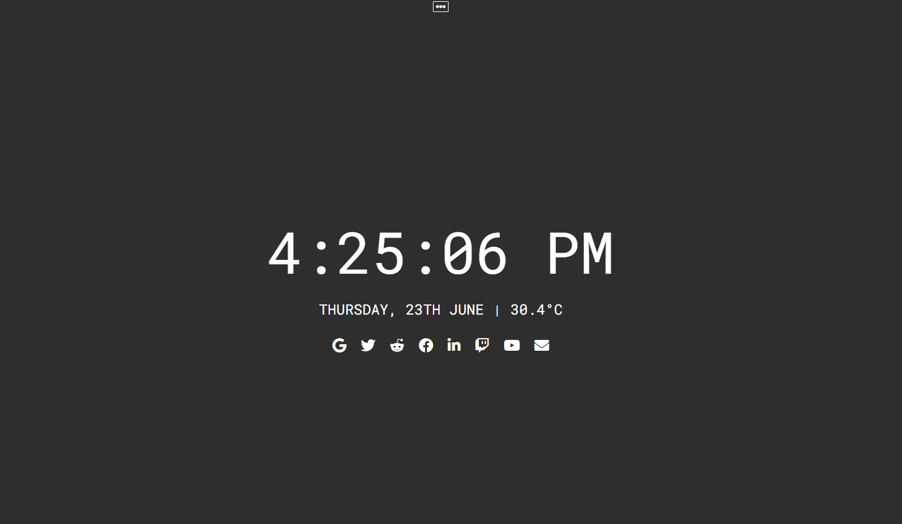

# EmeraldTab
 Chrome Extension that gives you a minimalistic new tab with some key information

 

# About
  EmeraldTab is a New Tab Chrome Extension that gives you Weather Data , Date/Time information and Quick Links with a customizable background.

# Installation
  - Run The Following Command to install dependencies
   ```sh
   npm install
   ```
  - To build the application
   ```sh
   npm run buildall
   ```

  - To Install extension to chrome (Note: Always prefer to Install from the Chrome web store)
  ```sh
  Open the 'Manage Extensions' Tab in Chrome.
  Select 'Load Unpacked' and add the 'public' folder.
  Turn on the extension and open a new tab.
  ```
